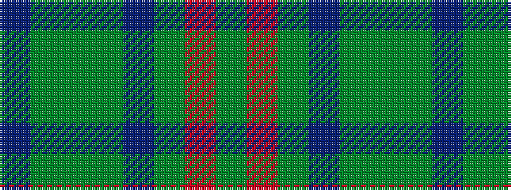

BGGGBGRG

It is a 8 stripe tartan.

<figure class="pat-woven">

<figcaption>idealised sample</figcaption>
</figure>

## Colour Sequence



## Tartans with this colour sequence

| Tartans |
|---------------|
| [Gayre Bodyguard](/setts/s8/dg18r6dg75db6dg13dy35dg12db6/)|
||
| [Glenlivet](/setts/s8/g18r6g75b6g13dy35g12b6/)|
||
| [Glenlivet Corporate Tartan Tartan Number: 193. Earliest known date: 1989 Designed for Glenlivet Distilleries Ltd, Strathspey. See products available Copyright © Blair Urquhart, Comrie, 2015](/setts/s8/g18r6g75db6g13dy35g12db6/)|
||
