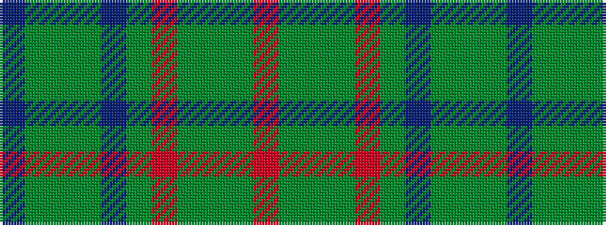

BGGGBGRGGGR

It is a 11 stripe tartan.

<figure class="pat-woven">

<figcaption>idealised sample</figcaption>
</figure>

## Colour Sequence



## Tartans with this colour sequence

| Tartans |
|---------------|
| [Markson (Personal)](/setts/s11/r16dg1g2dg1r4dg5t1dg5g14dg1t2~x2/)|
||
