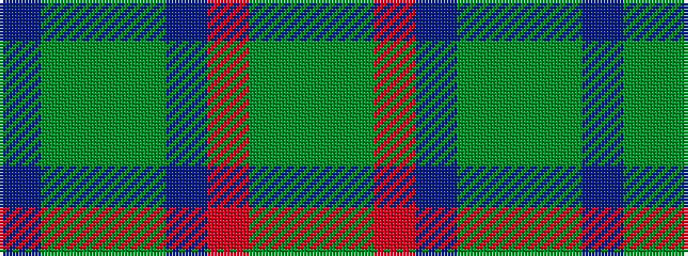

BGGGBRGG

It is a 8 stripe tartan.

<figure class="pat-woven">

<figcaption>idealised sample</figcaption>
</figure>

## Colour Sequence



## Tartans with this colour sequence

| Tartans |
|---------------|
| [Little-Dowse Wedding](/setts/s8/dy31y6o3db31dy8yi60y7b7~x2/)|
||
