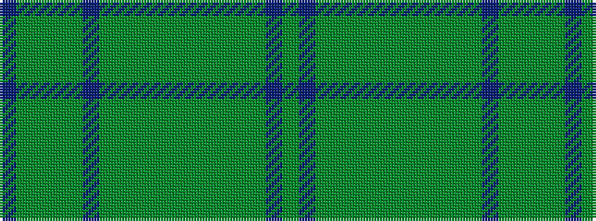

BGGGGBGGGGGGGGGGBG

It is a 18 stripe tartan.

<figure class="pat-woven">

<figcaption>idealised sample</figcaption>
</figure>

## Colour Sequence



## Tartans with this colour sequence

| Tartans |
|---------------|
| [Cuillins of Skye Fashion Tartan](/variants/s18/dr19dyi2dgi9dyi2dyii19dr2dyii19dyi2dgi9dyi2dg18dgi9dg18dyi2dgi9dyi2dr19dy3~x2/)|
||
