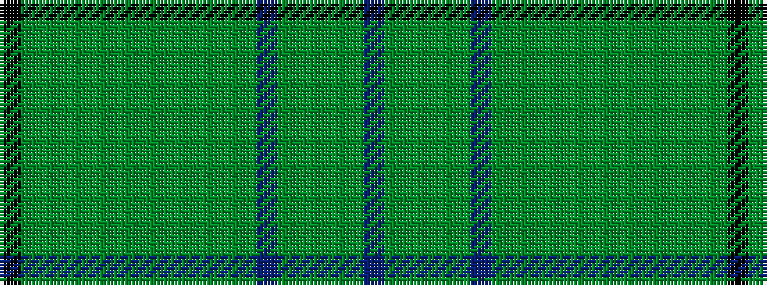

BGGGGBGGGGGGGGGGGK

It is a 18 stripe tartan.

<figure class="pat-woven">

<figcaption>idealised sample</figcaption>
</figure>

## Colour Sequence



## Tartans with this colour sequence

| Tartans |
|---------------|
| [Van Ingelgem Htg (Personal)](/variants/s18/k3dg18dy3dg3dy3dg3dy18y3dy3y3dy3y12db2y12dy9y12dg2db2~x2/)|
||
| [Van Ingelgem Hunting (Personal)](/variants/s18/k3yi18dg3yi3dg3yi3dg18y3dg3y3dg3y12n2y12dg9y12yi2n2~x2/)|
||
