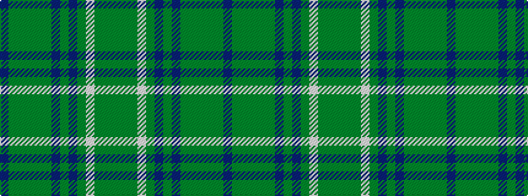

BGGGGGBGBGWGGG

It is a 14 stripe tartan.

<figure class="pat-woven">

<figcaption>idealised sample</figcaption>
</figure>

## Colour Sequence



## Tartans with this colour sequence

| Tartans |
|---------------|
| [Beechgrove Garden, The](/variants/s14/dp2g25dg8g2dg2g25dp2g2dp6g2w2g4dg16g2~x2/)|
||
