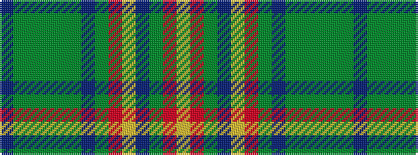

BGGGGGBGRYBGRY

It is a 14 stripe tartan.

<figure class="pat-woven">

<figcaption>idealised sample</figcaption>
</figure>

## Colour Sequence



## Tartans with this colour sequence

| Tartans |
|---------------|
| [Devon 2000](/variants/s14/db24g4dg2g8dg2g4db12g3r22ly3t8g3r22ly6~x2/)|
||
| [Devon 2000](/variants/s14/db24g4dg2g8dg2g4db12g3r22ly3b8g3r22ly6~x2/)|
||
