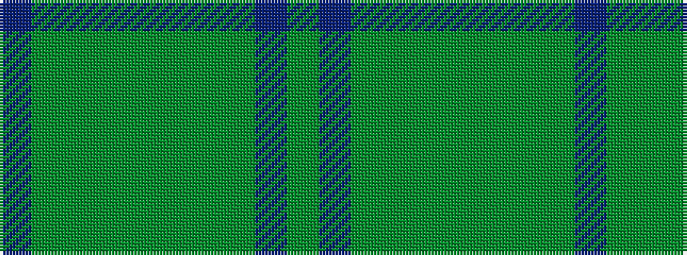

BGGGGGGGBG

It is a 10 stripe tartan.

<figure class="pat-woven">

<figcaption>idealised sample</figcaption>
</figure>

## Colour Sequence



## Tartans with this colour sequence

| Tartans |
|---------------|
| [Walters (Personal)](/variants/s10/gi2dp2gi20gi2gi2g1~x4/)|
||
