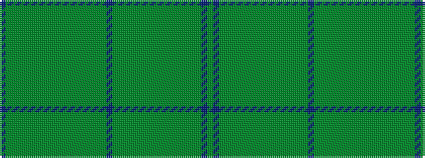

BGGGGGGGGGGGGGGGGGBGGGGGGGGGGGGGGGBG

It is a 36 stripe tartan.

<figure class="pat-woven">

<figcaption>idealised sample</figcaption>
</figure>

## Colour Sequence



## Tartans with this colour sequence

| Tartans |
|---------------|
| [Nova Scotia #2](/variants/s36/db50dg4dgi6dy28dgi1dy1dgi1dy1dgi1dy1dgi1dy1dgi1dy1dgi1dy1dgi8dg24db12dg4dy20dg1dy1dg1dy1dg1dy1dg1dy1dg1dy1dg1dy1dg8db8dy16/)|
||
