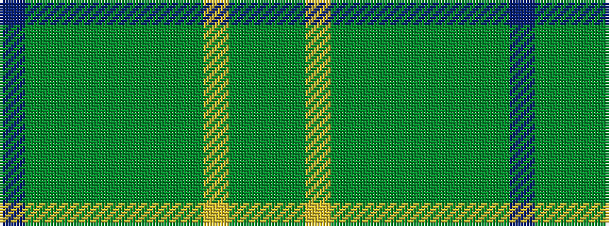

BGGGGGGGYGG

It is a 11 stripe tartan.

<figure class="pat-woven">

<figcaption>idealised sample</figcaption>
</figure>

## Colour Sequence



## Tartans with this colour sequence

| Tartans |
|---------------|
| [State Seal of Indiana (Fashion)](/setts/s11/db49dy19g5dg6g5dg6g35dg1lo4dg1g4~x2/)|
||
