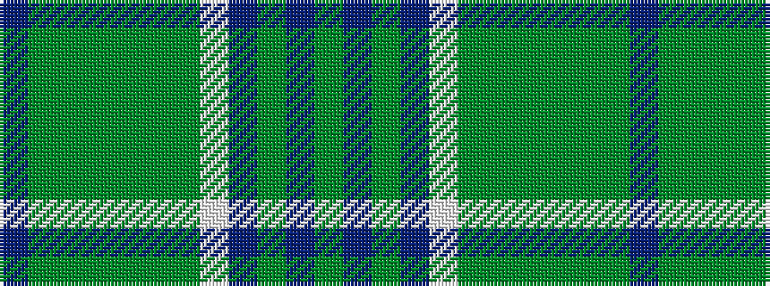

BGGGGGGWBGBG

It is a 12 stripe tartan.

<figure class="pat-woven">

<figcaption>idealised sample</figcaption>
</figure>

## Colour Sequence



## Tartans with this colour sequence

| Tartans |
|---------------|
| [Raibert Check](/variants/s12/db3dy14g2dy2g2dy3g6w18db3dy2db2dy2~x2/)|
||
