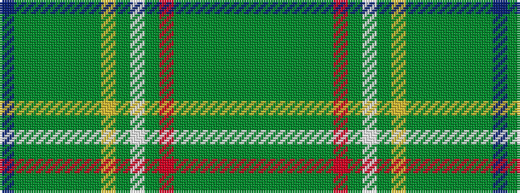

BGGGGGGYGWGRGGGGGG

It is a 18 stripe tartan.

<figure class="pat-woven">

<figcaption>idealised sample</figcaption>
</figure>

## Colour Sequence



## Tartans with this colour sequence

| Tartans |
|---------------|
| [Lorne, Marquis of #2](/variants/s18/dg10g8dg46g3dg3g55r4g5w4g5ly4g55dg3g3dg46g8dg10db10~x2/)|
||
