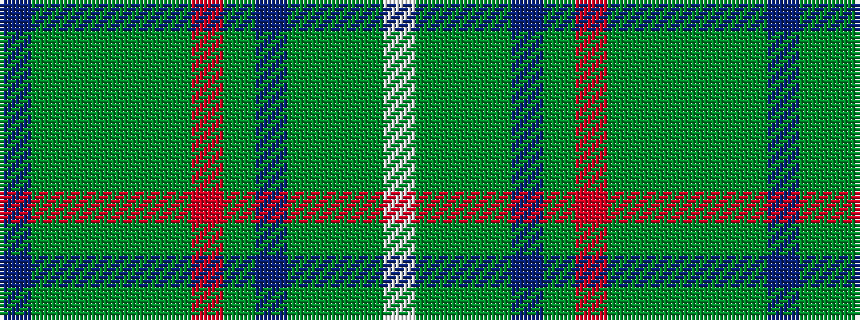

BGGGGGRGBGGGW

It is a 13 stripe tartan.

<figure class="pat-woven">

<figcaption>idealised sample</figcaption>
</figure>

## Colour Sequence



## Tartans with this colour sequence

| Tartans |
|---------------|
| [Afghanistan Memorial](/setts/s13/dt8dy3y1dy1y39dy3o3y2dt11dy8y2dy3w2~x2/)|
||
