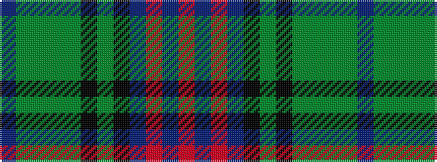

BGGGGKGKBRBR

It is a 12 stripe tartan.

<figure class="pat-woven">

<figcaption>idealised sample</figcaption>
</figure>

## Colour Sequence



## Tartans with this colour sequence

| Tartans |
|---------------|
| [Kinloch Anderson Hunting](/setts/s12/dp4g14y2g4y2k6g3k6db13r2db4r4~x2/)|
||
