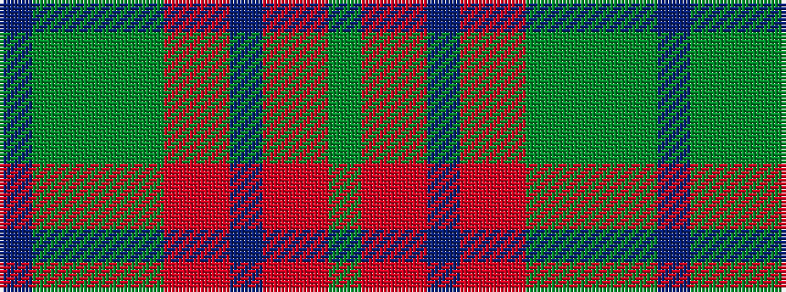

BGGGGRRBRRG

It is a 11 stripe tartan.

<figure class="pat-woven">

<figcaption>idealised sample</figcaption>
</figure>

## Colour Sequence



## Tartans with this colour sequence

| Tartans |
|---------------|
| [Ralston (USA)](/variants/s11/g7oi3o3t3o3oi3g12y4g4y4t3~x2/)|
||
| [Ralston Personal Tartan](/variants/s11/dg12oi4o4n4o4oi4dg18g5dg5g5n4~x2/)|
||
