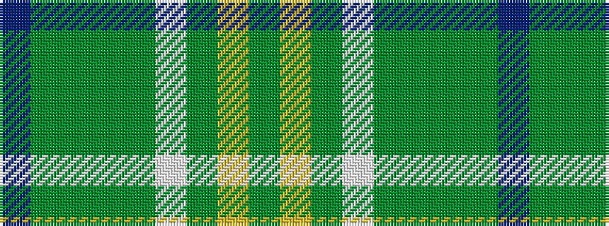

BGGGGWGYG

It is a 9 stripe tartan.

<figure class="pat-woven">

<figcaption>idealised sample</figcaption>
</figure>

## Colour Sequence



## Tartans with this colour sequence

| Tartans |
|---------------|
| [Boucherville (Tartan de..)](/setts/s9/g20ly2y5w4g2y2g2y2b6~x2/)|
||
