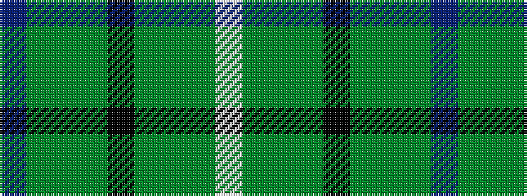

BGGGKGGGW

It is a 9 stripe tartan.

<figure class="pat-woven">

<figcaption>idealised sample</figcaption>
</figure>

## Colour Sequence



## Tartans with this colour sequence

| Tartans |
|---------------|
| [Duchess of York](/setts/s9/db1dy9dg5dy1k5dy1dg5dy9w1~x2/)|
||
| [Duchess of York (Fashion)](/setts/s9/db2dy18dg10dy1k10dy2dg10dy18w2~x2/)|
||
