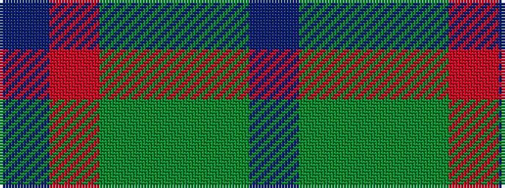

BGGGRB

It is a 6 stripe tartan.

<figure class="pat-woven">

<figcaption>idealised sample</figcaption>
</figure>

## Colour Sequence



## Tartans with this colour sequence

| Tartans |
|---------------|
| [Cetoloni](/variants/s6/db2r22dy11y2dy11db2~x2/)|
||
