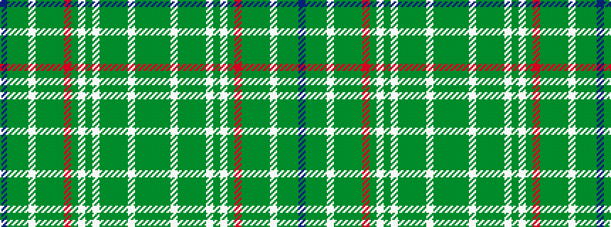

BGGGWGGGGRGWGWGGGGWGGG

It is a 22 stripe tartan.

<figure class="pat-woven">

<figcaption>idealised sample</figcaption>
</figure>

## Colour Sequence



## Tartans with this colour sequence

| Tartans |
|---------------|
| [Toshach](/setts/s22/g10dg4g10w2g10dg2g2dg20w4dg4w4dg4r4dg20g2dg2g10w2g10dg4g5t4~x2/)|
||
| [Toshach](/setts/s22/dg10dgi4dg10w2dg10dgi2dg2dgi20w4dgi4w4dgi4r4dgi20dg2dgi2dg10w2dg10dgi4dg5b4~x2/)|
||
