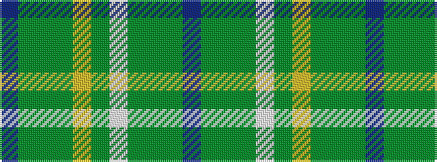

BGGGWGYGGGB

It is a 11 stripe tartan.

<figure class="pat-woven">

<figcaption>idealised sample</figcaption>
</figure>

## Colour Sequence



## Tartans with this colour sequence

| Tartans |
|---------------|
| [Manx, hunting](/setts/s11/db38dg1y11dg1w4dg1ly4dg1g20dg1t6~x2/)|
||
