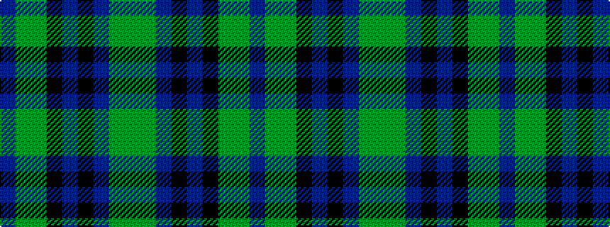

BGGKBKBGG

It is a 9 stripe tartan.

<figure class="pat-woven">

<figcaption>idealised sample</figcaption>
</figure>

## Colour Sequence



## Tartans with this colour sequence

| Tartans |
|---------------|
| [Fiddes - 2007 (Personal)](/variants/s9/g14dg14n14k1n1k1dg38g9n9~x2/)|
||
