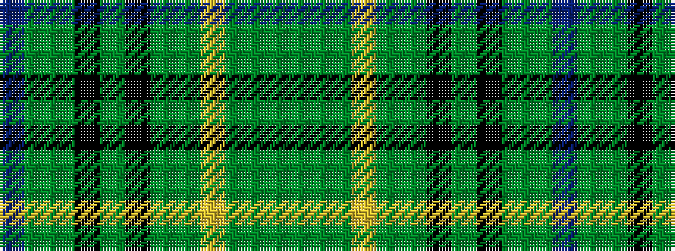

BGGKGKGGYGGG

It is a 12 stripe tartan.

<figure class="pat-woven">

<figcaption>idealised sample</figcaption>
</figure>

## Colour Sequence



## Tartans with this colour sequence

| Tartans |
|---------------|
| [Buchanan Hunting (Scott Adie)](/tartans/dy6g6dy6ly1dy6g6k6g4k6g6dy6t1/)|
||
| [Buchanan Hunting (Scott Adie) #2](/setts/s12/dy3g3dy3lo1dy3g3k3g3k3g3dy3t2~x8/)|
||
