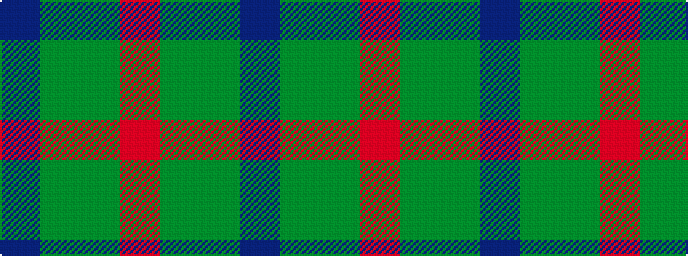

BGGR

It is a 4 stripe tartan.

<figure class="pat-woven">

<figcaption>idealised sample</figcaption>
</figure>

## Colour Sequence



## Tartans with this colour sequence

| Tartans |
|---------------|
| [Heslop Lurdenlaw by Kelso](/variants/s4/dt44dg12g1o6~x2/)|
||
