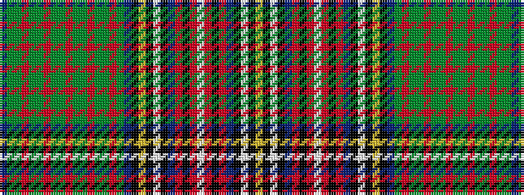

BGGRGGRGGRGGRGGRGBKYKWKBRKRWRKRBKWKY

It is a 36 stripe tartan.

<figure class="pat-woven">

<figcaption>idealised sample</figcaption>
</figure>

## Colour Sequence



## Tartans with this colour sequence

| Tartans |
|---------------|
| [Unidentified, Cotton sample](/setts/s36/db4g6dg7o1g6dg7o1g6dg7o1g6dg7o1g6dg7o1g6db4k8lo1k1w1k1db8r6k1r4w1r4k1r6db8k1w1k1lo1~x2/)|
||
