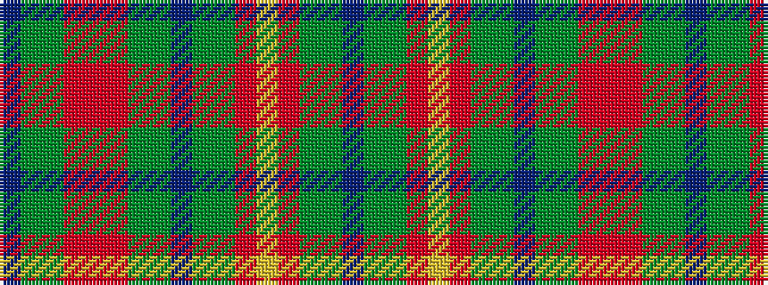

BGGRRRGGBGGRYRGGB

It is a 17 stripe tartan.

<figure class="pat-woven">

<figcaption>idealised sample</figcaption>
</figure>

## Colour Sequence



## Tartans with this colour sequence

| Tartans |
|---------------|
| [Indianapolis MPD Emerald Society](/setts/s17/db67dy5g10r5ly2r5g10dy5db4dy5g10r5o2r5dy5g10db24/)|
||
