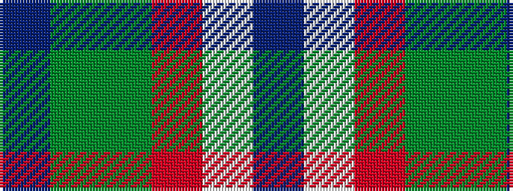

BGGRWB

It is a 6 stripe tartan.

<figure class="pat-woven">

<figcaption>idealised sample</figcaption>
</figure>

## Colour Sequence



## Tartans with this colour sequence

| Tartans |
|---------------|
| [Heriot Bay (District)](/variants/s6/b5dy2dg4o3w1b5~x8/)|
||
