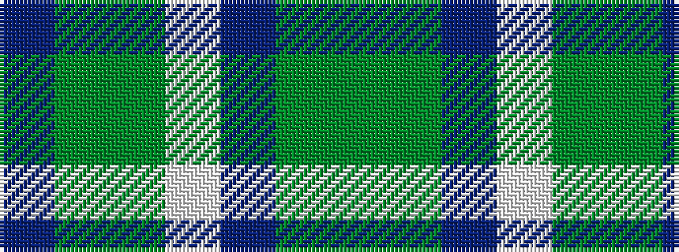

BGGWBGG

It is a 7 stripe tartan.

<figure class="pat-woven">

<figcaption>idealised sample</figcaption>
</figure>

## Colour Sequence



## Tartans with this colour sequence

| Tartans |
|---------------|
| [Mounth, The, (rejected)](/variants/s7/g36dg5db17w2g14y3p2~x2/)|
||
