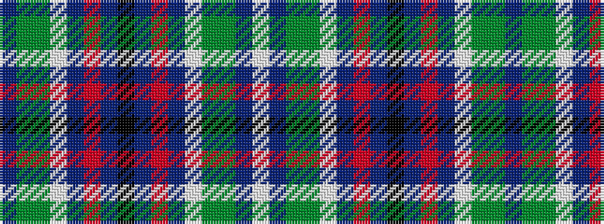

BGGWBRBKBRBWGGBW

It is a 16 stripe tartan.

<figure class="pat-woven">

<figcaption>idealised sample</figcaption>
</figure>

## Colour Sequence



## Tartans with this colour sequence

| Tartans |
|---------------|
| [Scotia (EWM)](/setts/s16/db58g28dy4w18db14r3db8k4db8r3db14w18dy4g28db58w4/)|
||
