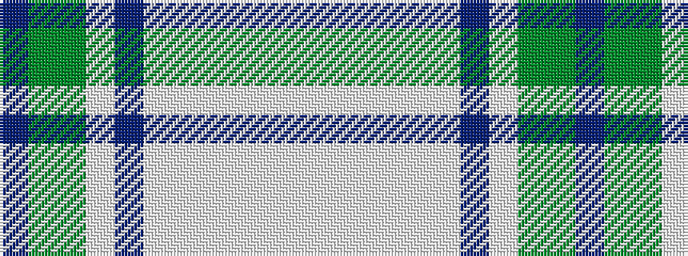

BGGWBWWWWWW

It is a 11 stripe tartan.

<figure class="pat-woven">

<figcaption>idealised sample</figcaption>
</figure>

## Colour Sequence



## Tartans with this colour sequence

| Tartans |
|---------------|
| [Manderson #1 (Personal)](/setts/s11/dr8dg22dg8lb16dr24lb8lb32lb32lb7lb12lb4/)|
||
