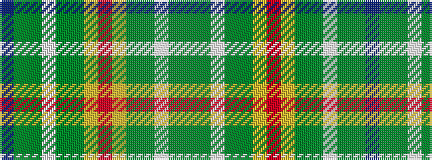

BGGWGGYRYGGWGG

It is a 14 stripe tartan.

<figure class="pat-woven">

<figcaption>idealised sample</figcaption>
</figure>

## Colour Sequence



## Tartans with this colour sequence

| Tartans |
|---------------|
| [Hannigan of Dirleton (Personal)](/variants/s14/dp4g4y2w3g27y30ly1r3~x2/)|
||
