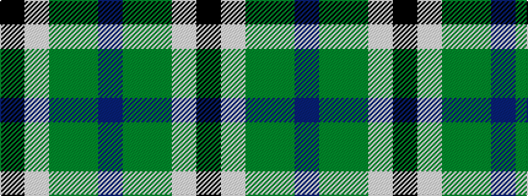

BGGWK

It is a 5 stripe tartan.

<figure class="pat-woven">

<figcaption>idealised sample</figcaption>
</figure>

## Colour Sequence



## Tartans with this colour sequence

| Tartans |
|---------------|
| [Michie, Andrew (Personal)](/setts/s5/dp62g5gi20lb5k1~x2/)|
||
