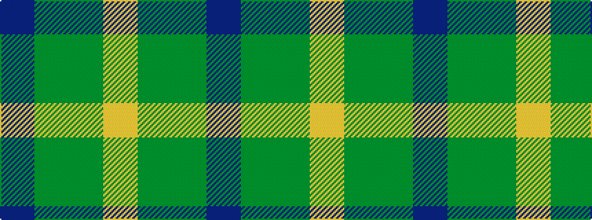

BGGY

It is a 4 stripe tartan.

<figure class="pat-woven">

<figcaption>idealised sample</figcaption>
</figure>

## Colour Sequence



## Tartans with this colour sequence

| Tartans |
|---------------|
| [Canadian Irish Regiment Regimental Tartan](/variants/s4/lo100dy26dg3dr2~x2/)|
||
| [Oxford University](/variants/s4/db9dg16g56ly4~x2/)|
||
