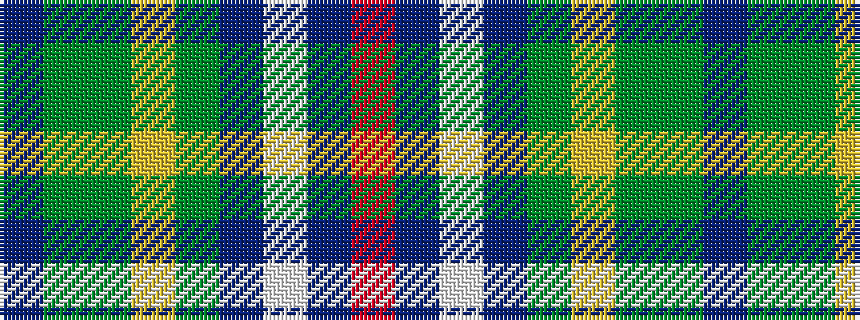

BGGYGBWBR

It is a 9 stripe tartan.

<figure class="pat-woven">

<figcaption>idealised sample</figcaption>
</figure>

## Colour Sequence



## Tartans with this colour sequence

| Tartans |
|---------------|
| [Connor (Personal)](/variants/s9/db1dy4g8ly1g8db12w1db2r1~x4/)|
||
