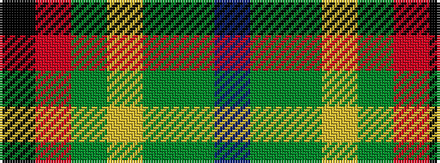

BGGYGRK

It is a 7 stripe tartan.

<figure class="pat-woven">

<figcaption>idealised sample</figcaption>
</figure>

## Colour Sequence



## Tartans with this colour sequence

| Tartans |
|---------------|
| [Snelgrove Htg (Name)](/variants/s7/k3r12dy8lo2g36dy10t2~x2/)|
||
