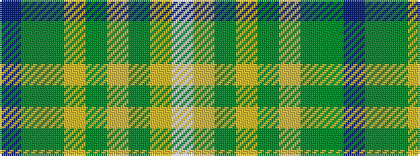

BGGYGYGYW

It is a 9 stripe tartan.

<figure class="pat-woven">

<figcaption>idealised sample</figcaption>
</figure>

## Colour Sequence



## Tartans with this colour sequence

| Tartans |
|---------------|
| [Macmillan Cancer Support](/setts/s9/p4g24dg6lg4dg4lg4dg44lo1w4/)|
||
