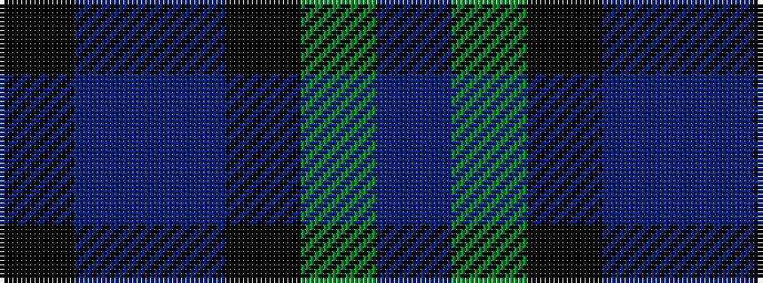

BGKBBK

It is a 6 stripe tartan.

<figure class="pat-woven">

<figcaption>idealised sample</figcaption>
</figure>

## Colour Sequence



## Tartans with this colour sequence

| Tartans |
|---------------|
| [Saorsa Corporate Tartan Tartan Number: 10739. Earliest known date: 07/11/2012 Designed by Maggie Scott-Stewart and Lori Scott Ryan for the Fellowship of the Thistle, a select group of invited individuals who work together for the 'betterment' and freedom of Scotland. Green represents the hills and glens of Scotland; blue represents the saltire; purple for the thistle and black for the union. The name of the tartan, 'Saorsa', means 'freedom' in Gaelic. Miss Lori Scott Ryan, 25/19 Gullans Close, Edinburgh, Mid Lothian, Scotland, EH8 8JW redruairidh@hotmail.co.uk See products available Copyright © Blair Urquhart, Comrie, 2015](/setts/s6/k11db3dp5k2y15db11~x2/)|
|![Saorsa Corporate Tartan Tartan Number: 10739. Earliest known date: 07/11/2012 Designed by Maggie Scott-Stewart and Lori Scott Ryan for the Fellowship of the Thistle, a select group of invited individuals who work together for the 'betterment' and freedom of Scotland. Green represents the hills and glens of Scotland; blue represents the saltire; purple for the thistle and black for the union. The name of the tartan, 'Saorsa', means 'freedom' in Gaelic. Miss Lori Scott Ryan, 25/19 Gullans Close, Edinburgh, Mid Lothian, Scotland, EH8 8JW redruairidh@hotmail.co.uk See products available Copyright © Blair Urquhart, Comrie, 2015 example sett](/setts/s6/k11db3dp5k2y15db11~x2/sett.png)|
