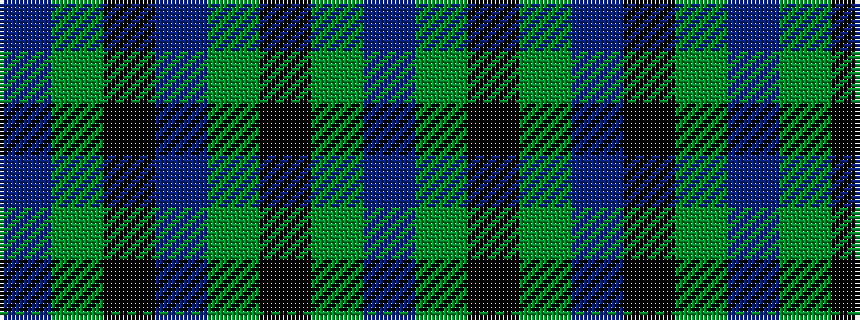

BGKBGKGB

It is a 8 stripe tartan.

<figure class="pat-woven">

<figcaption>idealised sample</figcaption>
</figure>

## Colour Sequence



## Tartans with this colour sequence

| Tartans |
|---------------|
| [Orkney Slate](/setts/s8/dt8y74k8dt42y11k2y16dt4/)|
||
