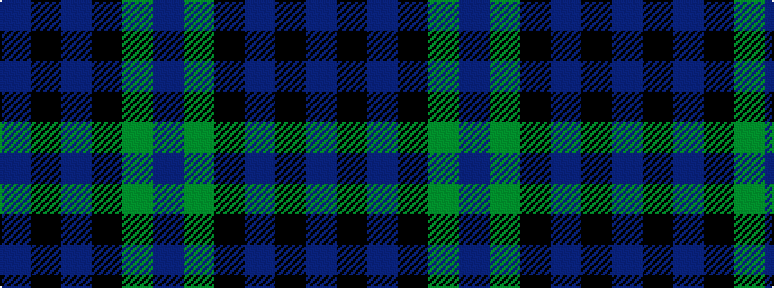

BGKBKB

It is a 6 stripe tartan.

<figure class="pat-woven">

<figcaption>idealised sample</figcaption>
</figure>

## Colour Sequence



## Tartans with this colour sequence

| Tartans |
|---------------|
| [Monarchs](/variants/s6/db19k4dr1k4dg9dr1~x4/)|
||
| [Wilson's, No 166](/variants/s6/t3g12k14t11k3t3~x2/)|
||
