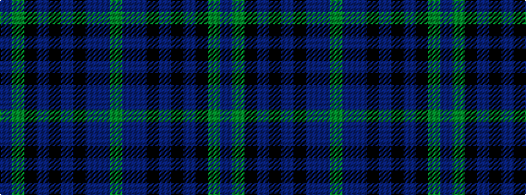

BGKBKBKBBG

It is a 10 stripe tartan.

<figure class="pat-woven">

<figcaption>idealised sample</figcaption>
</figure>

## Colour Sequence



## Tartans with this colour sequence

This pattern is a design lineage: every tartan below shares one colour order, whatever its owner —
near-identical designs are grouped, the largest lineage first (#112: the pattern is a tartan's
second parent, beside its family or clan).

<table class="sett-table">
<tbody>
<tr><td><a href="/variants/s10/dp2dg16k16db2k2db2k2db15dbi3y2~x2~db1204274-dbi1406275/">Brydon (2013)</a></td></tr>
<tr><td class="sett-swatch"></td></tr>
<tr><td><a href="/variants/s10/dp2dg16k16dt2k2dt2k2dt15db3y2~x2~dt1102249-db1108266/">Brydon (Scottish Borders)</a></td></tr>
<tr><td class="sett-swatch"></td></tr>
</tbody>
</table>

