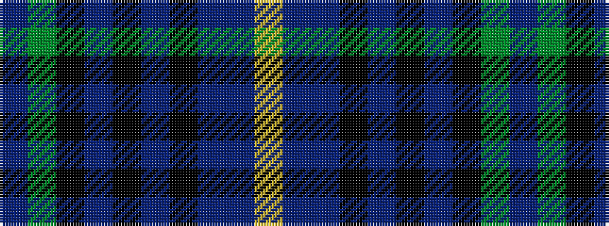

BGKBKBKBBY

It is a 10 stripe tartan.

<figure class="pat-woven">

<figcaption>idealised sample</figcaption>
</figure>

## Colour Sequence



## Tartans with this colour sequence

| Tartans |
|---------------|
| [Brydon (2013)](/setts/s10/dp2dg16k16db2k2db2k2db15dbi3ly2~x2/)|
||
