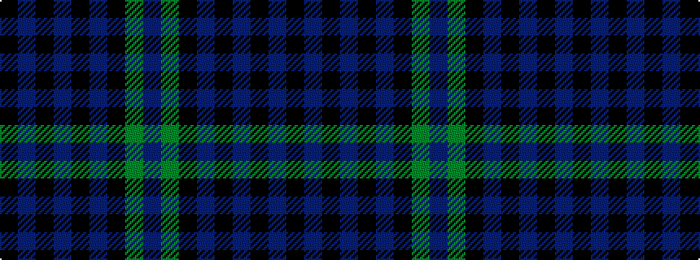

BGKBKBKBK

It is a 9 stripe tartan.

<figure class="pat-woven">

<figcaption>idealised sample</figcaption>
</figure>

## Colour Sequence



## Tartans with this colour sequence

| Tartans |
|---------------|
| [Aitchison (Personal)](/variants/s9/k2dt3k2dt18k11dt2k11g25dp2~x2/)|
||
| [Aitchison Family (Kinghorn) (Personal)](/variants/s9/k2db3k2db18k11db2k11g25p2~x2/)|
||
