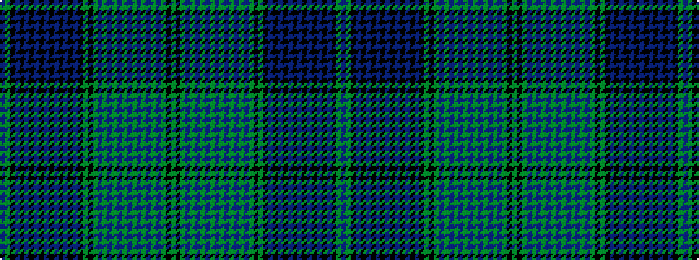

BGKBKBKBKBKBKBKBKGKGBGBGBGBGBGBGBGKG

It is a 36 stripe tartan.

<figure class="pat-woven">

<figcaption>idealised sample</figcaption>
</figure>

## Colour Sequence



## Tartans with this colour sequence

| Tartans |
|---------------|
| [Alberta](/variants/s36/dg50k4dy6db28dy1db1dy1db1dy1db1dy1db1dy1db1dy1db1dy8k24dg12k4db20k1db1k1db1k1db1k1db1k1db1k1db1k8dg8db16~x2/)|
||
| [Alberta Trade Tartan](/variants/s36/g50k4dy6db28dy1db1dy1db1dy1db1dy1db1dy1db1dy1db1dy8k24g12k4db20k1db1k1db1k1db1k1db1k1db1k1db1k8g8db16~x2/)|
||
