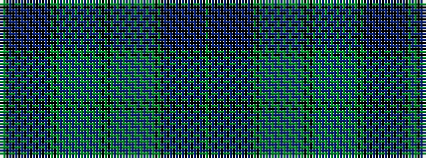

BGKBKBKBKBKBKBKBKGKGBGBGBGBGBGBGBGKGKGBGBGBGBGBGBGBGKGKBKBKBKBKBKBKBKG

It is a 70 stripe tartan.

<figure class="pat-woven">

<figcaption>idealised sample</figcaption>
</figure>

## Colour Sequence



## Tartans with this colour sequence

| Tartans |
|---------------|
| [Canadian Centennial #3](/variants/s70/g52k4dy6db14dy1db1dy1db1dy1db1dy1db1dy1db1dy1db1dy8k24g12k4db20k1db1k1db1k1db1k1db1k1db1k1db1k8g8db16~x2/)|
||
