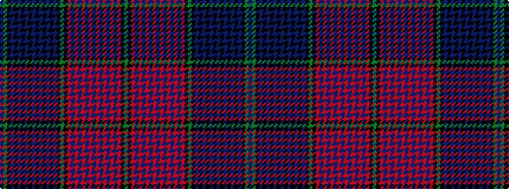

BGKBKBKBKBKBKBKBKGKRBRBRBRBRBRBRBRKG

It is a 36 stripe tartan.

<figure class="pat-woven">

<figcaption>idealised sample</figcaption>
</figure>

## Colour Sequence



## Tartans with this colour sequence

| Tartans |
|---------------|
| [13, Centennial Warp](/variants/s36/g52k4o6db28o1db1o1db1o1db1o1db1o1db1o1db1o8k24g12k4db20k1db1k1db1k1db1k1db1k1db1k1db1k8g8db16~x2/)|
||
