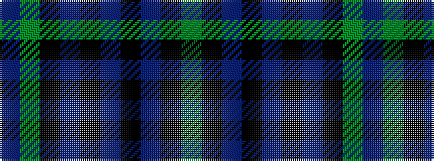

BGKBKBKBKG

It is a 10 stripe tartan.

<figure class="pat-woven">

<figcaption>idealised sample</figcaption>
</figure>

## Colour Sequence



## Tartans with this colour sequence

| Tartans |
|---------------|
| [Wilson's No.166](/setts/s10/g12k14t11k3t3k3t11k14g12t3~x2/)|
||
