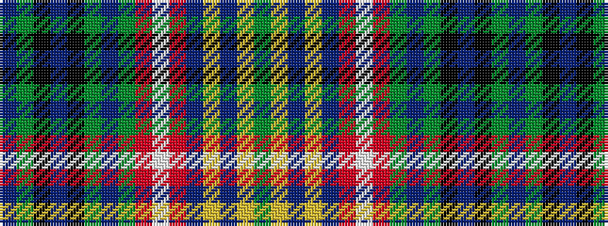

BGKBKGBGRWRBYBYG

It is a 16 stripe tartan.

<figure class="pat-woven">

<figcaption>idealised sample</figcaption>
</figure>

## Colour Sequence



## Tartans with this colour sequence

| Tartans |
|---------------|
| [Buchanan Incorrect](/setts/s16/db3dg1k3db3k3dg1db3dg1r6w1r6db4ly5db1ly5dg1~x4/)|
||
| [Buchanan, Incorrect](/setts/s16/db3g1k3db3k3g1db3g1r6w1r6db4ly5db1ly5g1~x4/)|
||
