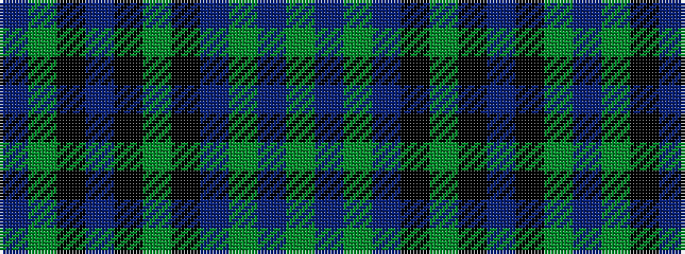

BGKBKGKBGBG

It is a 11 stripe tartan.

<figure class="pat-woven">

<figcaption>idealised sample</figcaption>
</figure>

## Colour Sequence



## Tartans with this colour sequence

| Tartans |
|---------------|
| [Black Water](/setts/s11/db1g6k2db1k3g1k2db2g1db6g1~x4/)|
||
