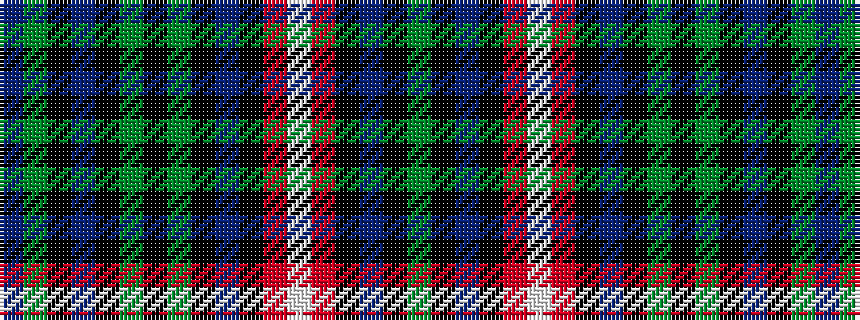

BGKBKGKGKBKRWRKBKG

It is a 18 stripe tartan.

<figure class="pat-woven">

<figcaption>idealised sample</figcaption>
</figure>

## Colour Sequence



## Tartans with this colour sequence

| Tartans |
|---------------|
| [Buchanan Hunting (Mackinlay strip)](/variants/s18/dg24k2t6k2m12w1m12k2t6k2dy12k2dy12k2t6k2dg12t6~x2/)|
||
