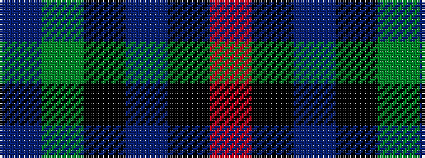

BGKBKR

It is a 6 stripe tartan.

<figure class="pat-woven">

<figcaption>idealised sample</figcaption>
</figure>

## Colour Sequence



## Tartans with this colour sequence

| Tartans |
|---------------|
| [MacCaughan or MacEachain (Personal)](/setts/s6/dp2dg6k2db6k1r2~x4/)|
||
| [MacCaughan, or MacEachain](/setts/s6/dp2g6k2db6k1r2~x4/)|
||
