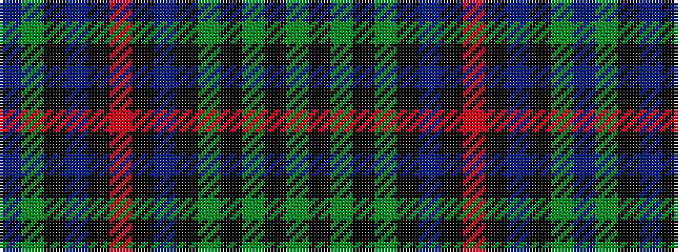

BGKBKRKBKGKGKG

It is a 14 stripe tartan.

<figure class="pat-woven">

<figcaption>idealised sample</figcaption>
</figure>

## Colour Sequence



## Tartans with this colour sequence

| Tartans |
|---------------|
| [Fleming of Castle Carrick (Personal)](/setts/s14/y17k3y3k3y3k16n18k1r3k1n18k16y9dp2~x2/)|
||
